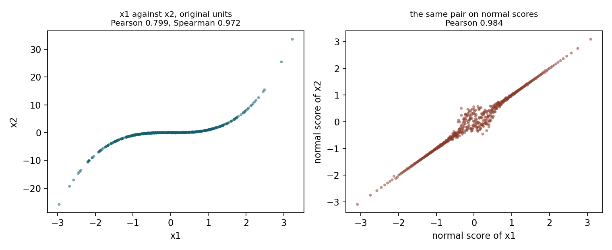
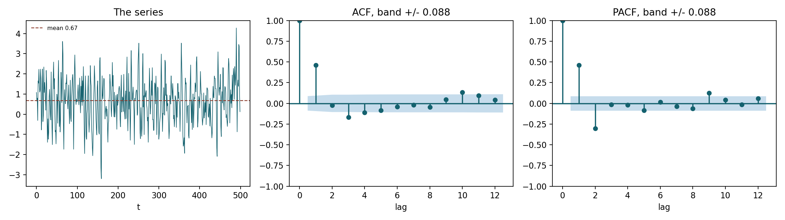

# How to read this document

Each problem below follows the three part structure the assignment asks for.
**Predict** states what I expected from the data before fitting anything and
why. **Fit** reports the models. **Reconcile** says whether the fit agreed with
the prediction and, where it did not, what I had missed.

Every number quoted here is printed by the script named at the head of the
section, and every figure is written by the same script. `README.md` gives the
commands. The problem statement itself is not reproduced here; it is
`Assignments/Assignment1/Assignment 1.pdf` in the class repository.

Two conventions are used throughout and are worth stating once, because
packages disagree about both:

* **Variance** uses the $n-1$ denominator. **Skewness and excess kurtosis** use
  the bias corrected estimators, and kurtosis is always reported in *excess*
  form, so a normal sample returns 0 rather than 3. `scipy.stats` defaults to
  the biased estimators, so `bias=False` is passed explicitly everywhere.
* **AICc** uses $k = p + d$, following Week 02: $p$ counts the regression
  parameters including the intercept, $d$ counts the parameters of the error
  distribution. A one regressor model with a normal error has $k = 3$; with a
  Student's $t$ error it has $k = 4$. `statsmodels` reports AIC only, so the
  correction term $\frac{2k^2 + 2k}{n - k - 1}$ is added by hand.

The course convention of 255 trading days per year is recorded in `common.py`.
No problem in this assignment asks for an annualized figure, so it is not
applied to anything.

\newpage

# Reading the Shape of a Sample

*Code: `problem1.py`.*

## Predict

The first four moments of `problem1.csv`, $n = 1000$:

| Moment | Value |
|:--|--:|
| Mean | $0.001104$ |
| Variance | $9.624822 \times 10^{-5}$ |
| Standard deviation | $0.009811$ |
| Skewness | $-0.6698$ |
| Excess kurtosis | $+2.3576$ |

: First four moments of the sample {#tbl-p1moments}

The biased estimators give $-0.6688$ and $+2.3398$; at $n = 1000$ the
correction is immaterial, but the convention still has to be stated because a
package reporting raw rather than excess kurtosis would have printed $5.36$ and
changed the reading entirely.

The pair is feasible: every distribution satisfies
kurtosis $\geq$ skewness$^2 + 1$, and here $5.3576 \geq 1.4487$.

{#fig-p1 width=100%}

**(a) Which Week 1 distributions could plausibly have produced this sample?**

The sample is **negatively skewed with fat tails**. Taking the four families
from Week 01 in turn, and naming the moment that does the rejecting:

* **Normal --- rejected, by the third moment and independently by the fourth.**
  The normal has skewness 0 and excess kurtosis 0 at every $\mu$ and $\sigma$.
  The sample has $-0.67$ and $+2.36$. Either one alone is fatal; both fire.
  This is not something fitting can repair, because neither moment is a free
  parameter of the family.

* **Lognormal --- rejected, by the third moment.** The lognormal has skewness
  $(e^{\sigma^2} + 2)\sqrt{e^{\sigma^2} - 1}$, which is *strictly positive* for
  every $\sigma > 0$. A negative sample skewness cannot be produced by any
  member of the family. There is a second, independent reason to reject it, but
  it is not a moment and I record it separately: the lognormal is supported on
  $(0, \infty)$ and 406 of the 1000 observations are negative.

* **Student's $t$ --- rejected, by the third moment.** The $t$ is symmetric, so
  its skewness is 0 whenever it exists ($\nu > 3$). It handles the fourth
  moment comfortably --- $6/(\nu - 4) = 2.36$ gives $\nu \approx 6.5$ --- but it
  leaves the skew entirely unexplained. This is the family that gets the tails
  right and the asymmetry wrong.

* **Normal inverse Gaussian --- survives.** Its skewness is
  $3\beta / (\alpha\sqrt{\delta\gamma})$, which takes the sign of $\beta$, so
  $\beta < 0$ delivers negative skew; its excess kurtosis
  $\frac{3}{\delta\gamma}\left(1 + \frac{4\beta^2}{\alpha^2}\right)$ is strictly
  positive. It is the only one of the four that can carry both signs at once.

So of the four families, only the NIG is admissible. By the shape table in
Week 01 a skewed $t$ or a generalized hyperbolic would also survive; they are
not among the four but they belong in the answer, because "the NIG is the only
possibility" would be a stronger claim than the moments support. Two moments
narrow the field; they do not pick a winner.

## Fit and reconcile

Matching the mean and the variance gives $N(0.001104,\ 0.009811^2)$. Its 1%
quantile is $-0.021719$.

**(b) How many observations fall below the fitted normal's 1% quantile?**

**26.** Under the fitted model the count is $\text{Binomial}(1000, 0.01)$, so
the expected number is **10** with a standard deviation of 3.15. The observed
count is $5.09$ standard deviations above expectation. This is not sampling
noise.

**(c) What would the fitted normal get wrong, where, and in which direction?**

Both tails, in opposite directions. Counting exceedances at four levels:

| $\alpha$ | Lower observed | Lower expected | Upper observed | Upper expected |
|--:|--:|--:|--:|--:|
| 0.005 | 18 | 5.0 | 5 | 5.0 |
| 0.010 | 26 | 10.0 | 6 | 10.0 |
| 0.025 | 40 | 25.0 | 15 | 25.0 |
| 0.050 | 50 | 50.0 | 34 | 50.0 |

: Exceedances of the fitted normal, both tails {#tbl-p1tails}

Three things follow, and they are exactly the two rejected moments made
visible.

**The left tail is understated, and the error grows as you go further out.**
At the 5% level the count is exact, 50 against 50. At 2.5% it is $1.6\times$
too many, at 1% $2.6\times$, at 0.5% $3.6\times$. The body of the distribution
is fine; the model fails only in the tail, and it fails worse the further into
the tail you look. That is the signature of the excess kurtosis in
@tbl-p1moments.

**The right tail is overstated.** 6 observations above the 99% quantile against
10 expected, 34 above the 95% against 50. The normal predicts *more* large
gains than occurred.

**The asymmetry between those two is the skewness.** A symmetric fat tailed
model would have missed on both sides in the same direction. Here the model
understates the left and overstates the right, which is precisely what a
symmetric family fitted to a left skewed sample must do: forced to be
symmetric, it splits the difference and is wrong in opposite directions on the
two sides.

For risk management this is the dangerous orientation of the error. If this
series is a return series, the fitted normal underestimates the frequency of
large losses by a factor of roughly three at the levels a capital calculation
cares about, while simultaneously flattering the upside.

\newpage

# A Regression Whose Errors Are Not Normal

*Code: `problem2.py`.*

## Predict

**(a) What does the scatter show, and what error distribution do I expect?**

The left panel of @fig-p2 shows a strong, clean positive linear
relationship --- a slope near 3 is readable by eye --- with two features that
matter. The vertical spread does not widen or narrow as $x$ moves, so there is
no fanning. But a handful of points sit far off the line in both directions,
much further than the bulk of the scatter would suggest.

That combination --- constant spread, occasional large deviations, roughly
symmetric --- is a **fat tailed but not heteroskedastic error**. I expect a
Student's $t$ to describe it and a normal not to.

The residual moments from the OLS fit confirm the reading before any
distributional model is fitted: skewness $-0.3624$, excess kurtosis $+3.6168$.
Excess kurtosis of $+3.6$ is a lot; $6/(\nu - 4) = 3.6$ implies $\nu \approx
5.7$.

{#fig-p2 width=100%}

**(b) Which of the seven OLS assumptions does this violate, and what will the
violation do?**

**Assumption 7, that the error term is normally distributed.** The other
candidates can be ruled out with the standard diagnostics:

| Assumption | Test | Result |
|:--|:--|:--|
| 4, uncorrelated errors | Durbin--Watson | $2.0159$, no serial correlation |
| 5, constant variance | Breusch--Pagan | $p = 0.7798$, no heteroskedasticity |
| 7, normal errors | Jarque--Bera | $106.23$, $p = 8.6\times10^{-24}$ |

: Which assumption actually fails {#tbl-p2diag}

Assumption 1 holds by construction (the model is linear in the parameters),
assumption 6 cannot fail with a single regressor, and assumptions 2 and 3 follow
in sample from including an intercept and fitting by least squares. Only
normality rejects, and it rejects overwhelmingly.

My predictions for what that does:

**To the estimated slope: almost nothing.** The unbiasedness of OLS requires
assumptions 1 through 3 and nothing about the shape of the error. Normality is
only needed to make the OLS solution *also* the maximum likelihood estimator
and to justify the inference built on top of it. So I expect the three slope
estimates to be close, and I expect the difference between them to be small
relative to one OLS standard error.

**To the standard error of that slope: real damage.** The formula
$s\sqrt{\operatorname{diag}((X'X)^{-1})}$ is derived under normality. Two
separate things go wrong when the error is fat tailed. First, $s^2$ is an
average of squared residuals, so the few very large residuals inflate it, and
the reported standard error is larger than an estimator that handled the tails
properly would need. Second, and more importantly, the reported number is no
longer the standard deviation of the sampling distribution of $\hat\beta$, so
the $t$ statistics and the confidence intervals built from it are not
trustworthy at their stated levels.

## Fit

| Model | $\alpha$ | $\beta$ | Error parameters | $\ln L$ | $k$ | AICc |
|:--|--:|--:|:--|--:|--:|--:|
| OLS | $1.5607$ | $2.9908$ | $s = 1.3514$ | $-343.0110$ | 3 | $692.1445$ |
| MLE, normal | $1.5607$ | $2.9908$ | $\sigma = 1.3446$ | $-343.0110$ | 3 | $692.1445$ |
| MLE, $t$ | $1.5480$ | $3.0192$ | $\sigma = 0.9355$, $\nu = 3.6322$ | $-328.5612$ | 4 | $\mathbf{665.3275}$ |

: Three models fitted to `problem2.csv`, $n = 200$ {#tbl-p2fits}

OLS standard errors are $0.0963$ on the intercept and $0.0966$ on the slope.

Two entries need explanation. The OLS and normal MLE rows are identical in
$\alpha$ and $\beta$ because they are the same estimator: the only term in the
normal log likelihood that involves $\beta$ is $-\sum \epsilon_i^2 / 2\sigma^2$,
so maximizing it over $\beta$ *is* minimizing the sum of squares. They differ
only in the variance estimate, and by exactly the expected factor:
$1.3514 \times \sqrt{198/200} = 1.3446$. The OLS row divides by $n - p$ and is
unbiased, the MLE row divides by $n$ and is not.

The $t$ row reports a **scale**, not a standard deviation. At $\nu = 3.6322$
the implied standard deviation is
$\sigma\sqrt{\nu/(\nu-2)} = 0.9355 \times 1.4919 = 1.3956$, slightly *above*
the normal's $1.3446$. This distinction matters in part (e) and is the single
easiest thing to get wrong in this problem.

**AICc selects the $t$ error model by a margin of 26.82.** The $t$ pays 2 extra
AIC points for its fourth parameter and recovers 28.9 in likelihood.

## Reconcile

**(c) Compare the three estimates of $\beta$.**

| Model | $\beta$ | Difference from OLS | In OLS standard errors |
|:--|--:|--:|--:|
| OLS | $2.9908$ | --- | --- |
| MLE, normal | $2.9908$ | $0.0000$ | $0.000$ |
| MLE, $t$ | $3.0192$ | $+0.0284$ | $0.294$ |

: The three slope estimates {#tbl-p2slopes}

The prediction was right, and if anything understated. OLS and the normal MLE
are numerically identical. The $t$ estimate moves the slope by $0.0284$, which
is **0.29 of one OLS standard error** --- well inside the noise of the estimate
itself. A violation severe enough to be rejected at $p = 10^{-24}$ moved the
parameter of interest by less than a third of its own standard error.

**(d) What is the rejected model getting wrong, if not the slope?**

**The shape of the error distribution, and therefore everything downstream of
it except the conditional mean.**

The two models agree about where the line is. They disagree about how the
observations are scattered around it, and that disagreement is what the
likelihood is scoring. A $\Delta$AICc of $26.82$ corresponds to a log
likelihood difference of $14.45$, so the $t$ assigns the observed residuals
about $e^{14.45} \approx 1.9 \times 10^{6}$ times more joint density than the
normal does. The data are nearly two million times more probable under the
$t$ --- and the slope barely moved.

Concretely, what the normal model gets wrong is every quantity that depends on
the error distribution beyond its first two moments:

* prediction and confidence intervals at any level in the tail;
* the probability of an exceedance of a given size, which is what a risk limit
  is;
* Value at Risk and Expected Shortfall computed from the fitted residual;
* the significance of the coefficients, since the $t$ statistics assume
  normality.

What it gets right is the conditional mean. If the only thing wanted from this
regression is a point forecast of $y$ given $x$, the normal model is fine. If
anything at all is wanted about the distribution around that forecast, it is
not.

**(e) Compare the 95% and 99.5% quantiles of the two fitted errors.**

| Level | Fitted normal | Fitted $t$ | Wider |
|--:|--:|--:|:--|
| 95.0% | $2.2117$ | $2.0538$ | normal |
| 97.5% | $2.6354$ | $2.7045$ | $t$ |
| 99.0% | $3.1281$ | $3.7098$ | $t$ |
| 99.5% | $3.4635$ | $4.6201$ | $t$ |

: Quantiles of the two fitted error distributions {#tbl-p2quantiles}

**The normal is wider at 95%, the $t$ is wider at 99.5%, and the two curves
cross at about the 97.03% level.**

The reason is that both distributions are fitted to the same 200 residuals, so
they are forced to agree about where the bulk of the data sits. The $t$ buys
its heavy tails by pulling in its body: its scale is $0.9355$ against the
normal's $1.3446$, a body 30% narrower. Out to roughly two standard deviations
that narrower body dominates and the $t$ is the *tighter* distribution. Past
the crossover the $t$'s polynomial tail decay, $(1 + z^2/\nu)^{-(\nu+1)/2}$,
overtakes the normal's $e^{-z^2/2}$, and at $\nu = 3.63$ it does so quickly:
by 99.5% the $t$ is 33% wider.

This is the same trade Week 01 describes when it says the $t$ has $\nu - 1$
finite moments and converges to the normal only as $\nu \to \infty$. A
distribution fitted to data cannot be fatter everywhere; it can only
redistribute mass, and the $t$ redistributes it from the shoulders to the
tails.

**Which would I want for a capital buffer? The $t$, without hesitation.**

A capital buffer is set at a far quantile --- the Basel framework uses 99% VaR
or 97.5% Expected Shortfall --- and every level in @tbl-p2quantiles at or
beyond 97.5% has the $t$ wider. At 99.5% the normal would set a buffer of
$3.4635$ where the $t$ calls for $4.6201$: the normal buffer is 75% of the
required size, a 25% shortfall on the number whose entire purpose is to survive
the tail.

The 95% comparison is a trap worth naming explicitly. Read on its own it says
the normal is the more conservative model, and that reading is exactly backwards
for the use case. The model selection statistic and the tail behaviour agree
with each other; only the 95% quantile, taken in isolation, points the other
way, and 95% is not where a capital buffer lives.

\newpage

# Pearson Against Spearman

*Code: `problem3.py`.*

## Predict

The pairwise plot is the whole prediction. Before computing any correlation,
the marginal shapes of the four series are:

| Series | Mean | SD | Skewness | Excess kurtosis | Min | Max |
|:--|--:|--:|--:|--:|--:|--:|
| `x1` | $-0.0519$ | $1.0108$ | $0.079$ | $0.039$ | $-2.959$ | $3.228$ |
| `x2` | $-0.0804$ | $3.8945$ | $0.907$ | $\mathbf{21.992}$ | $\mathbf{-25.834}$ | $\mathbf{33.638}$ |
| `x3` | $-0.0000$ | $0.9845$ | $-0.118$ | $0.330$ | $-3.293$ | $3.607$ |
| `x4` | $0.0757$ | $0.9668$ | $0.247$ | $-0.035$ | $-2.388$ | $2.959$ |

: Marginal shape of each series {#tbl-p3marginals}

**(a) Which pair will Pearson and Spearman disagree on most? Which will they
agree on?**

`x2` is unlike the other three. Its excess kurtosis is 22 against roughly 0 for
the others, and its range runs to $\pm 30$ where the others stop near $\pm 3$.
`x1`, `x3` and `x4` are all close to normal in shape.

Pearson is computed on values and is therefore sensitive to how far out the
extreme observations sit. Spearman is computed on ranks and is not: an
observation at $z = 8$ and an observation at $z = 3$ have adjacent ranks and
contribute identically. So:

* **I expect the largest disagreement on a pair involving `x2`, and on
  `x1`--`x2` in particular.** In the scatter, `x1` and `x2` clearly move
  together, but the cloud is stretched vertically into a shape no straight line
  fits well. Pearson should come in materially below Spearman.
* **I expect agreement on every pair that does not involve `x2`.** `x1`--`x3`,
  `x1`--`x4` and `x3`--`x4` all pair two near normal margins, and with both
  margins well behaved the linear and the monotone summaries measure nearly the
  same thing.
* **`x4` looks independent of everything**, so both coefficients should be near
  zero for its three pairs and will trivially agree.

{#fig-p3pairs width=88%}

## Fit and reconcile

**(b) Both correlation matrices, and the pair with the largest gap.**

Pearson (lower triangle) and Spearman:

| Pair | Pearson | Spearman | $\lvert$gap$\rvert$ |
|:--|--:|--:|--:|
| `x1`--`x2` | $+0.7991$ | $+0.9719$ | $\mathbf{0.1728}$ |
| `x2`--`x3` | $+0.5876$ | $+0.6674$ | $0.0798$ |
| `x1`--`x3` | $+0.7195$ | $+0.6839$ | $0.0356$ |
| `x2`--`x4` | $-0.0209$ | $-0.0011$ | $0.0198$ |
| `x3`--`x4` | $-0.0086$ | $-0.0024$ | $0.0062$ |
| `x1`--`x4` | $-0.0047$ | $+0.0002$ | $0.0049$ |

: Every pair, sorted by the size of the gap {#tbl-p3gaps}

**The largest gap is `x1`--`x2`: Pearson $0.7991$ against Spearman $0.9719$, a
gap of $0.1728$.** The prediction holds in full. The two largest gaps are the
two pairs involving `x2`, the three pairs involving `x4` are all near zero in
both measures and agree to within $0.02$, and `x1`--`x3` --- two well behaved
margins --- agree to $0.036$.

**(c) What mechanism produces the gap?**

Week 02 gives two distinct mechanisms that can open a Pearson--Spearman gap,
and they call for different answers to the rest of this question, so the first
job is to determine which one is operating. Each has a diagnostic.

**Mechanism A, a handful of outliers.** If a few extreme points are dragging
Pearson, removing them should close the gap.

| Trimming rule | Points dropped | Pearson | Spearman | Gap |
|:--|--:|--:|--:|--:|
| none | 0 | $0.7991$ | $0.9719$ | $0.1728$ |
| $\lvert z\rvert < 4$ | 5 | $0.8404$ | $0.9711$ | $0.1307$ |
| $\lvert z\rvert < 3$ | 12 | $0.8507$ | $0.9698$ | $0.1191$ |
| $\lvert z\rvert < 2.5$ | 21 | $0.8570$ | $0.9681$ | $0.1111$ |

: Trimming the extremes does not close the gap {#tbl-p3trim}

Trimming helps and then stops helping. Dropping the five most extreme
observations moves Pearson by $0.04$; dropping 21 --- 4% of the sample, which
is already more surgery than one would defend --- moves it by $0.06$ and leaves
a gap of $0.111$, still the largest in @tbl-p3gaps. **This is not an outlier
story.**

**Mechanism B, a monotone but non-linear relationship.** If the dependence is
monotone and the deficit in Pearson is the *shape of the margins*, then
replacing both margins with normal scores --- a rank preserving transform, so
the dependence structure is untouched --- should restore a high linear
correlation.

**Pearson on normal scores: $0.9845$.** Against a raw Pearson of $0.7991$ and a
Spearman of $0.9719$. That is decisive.

The mechanism is therefore: **`x1` and `x2` have almost identical rank
orderings, and the entire Pearson deficit is the marginal shape of `x2`.**
Fitting a $t$ to each margin makes the asymmetry explicit --- `x1` returns
$\nu = 177.9$, which is a normal for all practical purposes, while `x2` returns
$\nu = 0.485$, heavier tailed than a Cauchy. The right panel of
@fig-p3widest shows the pair before and after the rank
transform: an unusable cloud with a few points thrown to the corners becomes a
tight, straight, near deterministic band.

{#fig-p3widest width=100%}

**Which coefficient is the honest description of this pair?**

**Spearman.** The question anyone asks of a pair of series is whether they move
together, and the honest answer here is that they move together almost without
exception: when `x1` is high in its own distribution, `x2` is high in its own
distribution, and the rank agreement is $0.97$. Pearson's $0.80$ understates
that badly, and it understates it for a reason that has nothing to do with the
relationship --- it is an artifact of `x2` being measured on a scale with an
enormously heavy tail.

**What question is Pearson answering?** "How well does a straight line, in the
original units, describe this pair?" And $0.7991$ is a *correct* answer to that
question. A straight line genuinely does not describe these two series well,
because `x2`'s extremes are so far out that no line can pass near both them and
the body. Pearson is not wrong; it is answering a question about linear fit in
raw units, and that question was not the one being asked.

One qualification, because it is the case where Pearson would be the number to
use. If the purpose is to build a covariance matrix and compute a portfolio
variance in the original units, the linear coefficient is the one that enters
the arithmetic, and Spearman cannot be substituted for it. But with `x2`'s
excess kurtosis at 22 the variance is a poor summary of `x2` in the first
place. This is exactly the situation Week 05 resolves with a copula: use the
rank correlation to describe the dependence, fit each margin its own
distribution, and stop asking a single Pearson coefficient to carry both jobs.

\newpage

# Conditional Distributions

*Code: `problem4.py`.*

## Predict

The sample covariance matrix of `problem4.csv`, $n = 1000$, rows and columns
ordered `x1`, `x2`:

$$
\hat\Sigma = \begin{pmatrix} 1.099875 & 1.696902 \\ 1.696902 & 4.104749 \end{pmatrix},
\qquad \hat\rho = 0.798623
$$

**Block mapping.** The Week 02 result partitions $X$ into $x_1$ and $x_2$,
conditions on $x_2 = a$, and returns the distribution of $x_1$. This problem
conditions on `x1` and asks about `x2`, which is the other way round, so the
blocks map as:

| Week 02 block | This problem | Value |
|:--|:--|--:|
| $\Sigma_{11}$ (variable of interest) | $\operatorname{var}(\texttt{x2})$ | $4.104749$ |
| $\Sigma_{22}$ (conditioned on) | $\operatorname{var}(\texttt{x1})$ | $1.099875$ |
| $\Sigma_{12}$ (cross block) | $\operatorname{cov}(\texttt{x2}, \texttt{x1})$ | $1.696902$ |

: Which series is which block {#tbl-p4blocks}

**(a) The conditional variance, and the factor by which uncertainty falls.**

$$
\bar\Sigma = \Sigma_{11} - \Sigma_{12}\Sigma_{22}^{-1}\Sigma_{21}
= \operatorname{var}(\texttt{x2}) - \frac{\operatorname{cov}(\texttt{x1},\texttt{x2})^2}{\operatorname{var}(\texttt{x1})}
= 4.104749 - \frac{1.696902^2}{1.099875} = 1.486746
$$

As a formula in the same blocks, the factor is

$$
\frac{\bar\Sigma}{\Sigma_{11}} = 1 - \frac{\Sigma_{12}^2}{\Sigma_{11}\Sigma_{22}} = 1 - \rho^2
$$

and for this data $1 - 0.798623^2 = \mathbf{0.362201}$.

So learning `x1` removes **63.8%** of the variance of `x2`. In standard
deviation terms the conditional $\sigma$ is $\sqrt{1.486746} = 1.219322$
against an unconditional $2.026018$, a reduction to $\sqrt{0.362201} =
\mathbf{60.18\%}$ of what it was.

**(b) Does that factor depend on the value of `x1` observed?**

**No.** The term that settles it is the *absence* of a term: the conditioning
value $a$ appears in

$$
\bar\mu = \mu_1 + \Sigma_{12}\Sigma_{22}^{-1}(a - \mu_2)
$$

and appears nowhere in

$$
\bar\Sigma = \Sigma_{11} - \Sigma_{12}\Sigma_{22}^{-1}\Sigma_{21}.
$$

Under the multivariate normal the conditional variance is built out of the
covariance structure alone. Observing `x1` at its mean and observing it four
standard deviations away reduce the uncertainty about `x2` by exactly the same
amount. This is answered before looking at the data because it is a structural
property of the family, not a property of any sample.

It is also the property that part (f) turns out to depend on.

## Fit and reconcile

**(c) The conditional mean.**

$$
\bar\mu = \mu_1 + \Sigma_{12}\Sigma_{22}^{-1}(a - \mu_2)
= \overline{\texttt{x2}} + \frac{\operatorname{cov}(\texttt{x1},\texttt{x2})}{\operatorname{var}(\texttt{x1})}\left(\texttt{x1} - \overline{\texttt{x1}}\right)
$$

The coefficient on `x1` is
$\Sigma_{12}\Sigma_{22}^{-1} = 1.696902 / 1.099875 = \mathbf{1.542813}$, with an
implied intercept of $0.071073$.

**In regression terms this coefficient is the OLS slope of `x2` on `x1`.** Not
an analogue of it --- the same number. Week 02 derives $\hat\beta_i =
\operatorname{cov}(x_i, y)/\sigma_{x(i)}^2$ from a minimization problem and
$\Sigma_{12}\Sigma_{22}^{-1}$ from conditioning a normal vector, and they are
one object arriving through two doors. The script fits the OLS line
independently as a check: it returns a slope of $1.542813$, agreeing to
$4.4 \times 10^{-16}$.

The 95% band is $\bar\mu \pm 1.96\sqrt{\bar\Sigma} = \bar\mu \pm 2.389871$.
**Its half width is a constant**, precisely because of part (b): $\bar\Sigma$
does not contain $a$, so the band drawn in @fig-p4 has parallel
edges.

{#fig-p4 width=100%}

**(d) What fraction of observations fall inside the band?**

**935 of 1000, or $0.9350$.** The nominal level is $0.95$. The binomial
standard error at the nominal level is $0.0069$, so the shortfall is $2.18$
standard errors --- noticeable, but on its own not dramatic. The bucketed
version below is where the real problem shows.

**(e) Coverage by how far `x1` sits from its mean.**

| Bucket | $n$ | Coverage | SE | Residual SD |
|:--|--:|--:|--:|--:|
| within 1 sd | 759 | $0.9565$ | $0.0074$ | $1.0758$ |
| between 1 and 2 sd | 190 | $0.8579$ | $0.0253$ | $1.5804$ |
| beyond 2 sd | 51 | $0.9020$ | $0.0416$ | $1.5957$ |

: Coverage within each bucket {#tbl-p4buckets}

The band assumes a single conditional standard deviation of $1.2193$
everywhere. The last column shows what the residuals actually do.

**(f) What does the non-flat coverage tell us, and which assumption failed?**

**The pattern.** Coverage is *above* nominal near the centre of `x1` and
*below* it away from the centre, and the residual standard deviation grows
monotonically across the buckets --- $1.076$, $1.580$, $1.596$ --- against the
pooled $1.219$ the band assumes. The conditional spread of `x2` is not
constant: **it grows with how far `x1` sits from its mean.** In the middle the
band is too wide, so it over-covers; in the tails it is too narrow, so it
under-covers.

**The assumption that failed is joint normality**, and specifically the
consequence of it established in part (b): that the conditional variance does
not depend on the conditioning value. That is the sole reason the band was
drawn with constant width. Remove it and the constant width band has no
justification, which is what @tbl-p4buckets is measuring.

Supporting evidence that the joint normal is not the right family: the residual
has excess kurtosis $+1.5130$ and Jarque--Bera $p = 1.4 \times 10^{-21}$, and
neither margin is normal either (`x1` has excess kurtosis $+3.872$, `x2`
$+1.521$). A joint normal has normal margins; these do not.

**A family that does reproduce the pattern.** The natural candidate is a
bivariate $t$, and fitting one turns "something like a $t$" into a number that
can be checked. Maximum likelihood gives $\nu = 4.490$ and a scale matrix whose
implied covariance $\frac{\nu}{\nu-2}\Sigma$ is

$$
\begin{pmatrix} 1.094994 & 1.749290 \\ 1.749290 & 4.404128\end{pmatrix}
\quad\text{against the sample}\quad
\begin{pmatrix} 1.099875 & 1.696902 \\ 1.696902 & 4.104749\end{pmatrix}
$$

with an implied correlation of $0.7966$ against the sample $0.7986$. Under a
bivariate $t$ the conditional standard deviation of `x2` given `x1` carries a
multiplier $\sqrt{(\nu + d_1)/(\nu + 1)}$, where $d_1$ is the squared
standardized distance of the conditioning value from its mean --- **a
conditional variance that does depend on the observed `x1`**, which is exactly
the property the normal forbids and the data displays. Evaluated at the fitted
$\nu$:

| Bucket | Typical $\lvert z\rvert$ | Predicted SD | Observed SD |
|:--|--:|--:|--:|
| within 1 sd | $0.5$ | $1.1330$ | $1.0758$ |
| between 1 and 2 sd | $1.4$ | $1.3216$ | $1.5804$ |
| beyond 2 sd | $2.5$ | $1.7055$ | $1.5957$ |

: Bivariate $t$ prediction against the observed bucket residuals {#tbl-p4t}

The direction and rough magnitude match; the middle bucket comes in above the
prediction and the outer bucket below it. I would not claim more than "the
right shape" from this, for the reason in the caveat below.

**Which parts of (c) survive, and which do not.** The assignment asks to be
careful here, and the split is clean:

* **The conditional mean survives, coefficient and all.** Two independent
  reasons. First, the bivariate $t$ is an *elliptical* distribution, and every
  elliptical distribution has a conditional mean that is exactly linear in the
  conditioning variable with the same coefficient
  $\Sigma_{12}\Sigma_{22}^{-1}$. Second, and more generally, that coefficient
  is the best linear predictor of `x2` given `x1` for *any* joint distribution
  with finite second moments --- it is a statement about second moments and
  requires no distributional assumption at all. The line drawn in the figure is
  the right line.
* **The constant width of the band does not survive.** It rests entirely on
  $\bar\Sigma$ being free of $a$, which is a property of the normal and not of
  the data.
* **The 95% claim does not survive either.** Even a band correctly widened with
  $\lvert x_1\rvert$ would need the conditional *distribution* to be normal for
  $1.96$ to be the right multiplier, and the residual's excess kurtosis of
  $+1.51$ says it is not.

So what is left of part (c) is the regression line. What is lost is everything
about the uncertainty around it.

**One caveat on reading @tbl-p4buckets.** Coverage is not monotone across the
three buckets: the middle bucket ($0.8579$) sits below the outer one
($0.9020$). With only 51 observations beyond two standard deviations, the
standard error there is $0.0416$, so those two figures are about one standard
error apart and the ordering between them should not be interpreted. The signal
that is robust is the contrast between the inner bucket, which over-covers by
more than its own standard error, and the two outer buckets, which under-cover.

\newpage

# Identifying an AR or MA Order

*Code: `problem5.py`.*

## Predict

$n = 500$, mean $0.6709$, standard deviation $1.1211$. The significance band is
$\pm 1.96/\sqrt{500} = \pm 0.0877$.

{#fig-p5 width=100%}

| Lag | ACF | Outside band | PACF | Outside band |
|--:|--:|:-:|--:|:-:|
| 1 | $+0.4616$ | yes | $+0.4616$ | yes |
| 2 | $-0.0254$ | | $-0.3031$ | **yes** |
| 3 | $-0.1657$ | yes | $-0.0147$ | |
| 4 | $-0.1104$ | yes | $-0.0169$ | |
| 5 | $-0.0841$ | | $-0.0843$ | |
| 6 | $-0.0405$ | | $+0.0159$ | |
| 7 | $-0.0193$ | | $-0.0381$ | |
| 8 | $-0.0469$ | | $-0.0632$ | |

: ACF and PACF, first eight lags {#tbl-p5acf}

**(a) Which cuts off, which decays, and what order?**

**The PACF cuts off after lag 2. The ACF decays.** That is an **AR(2)**, and I
commit to it before fitting.

The PACF is significant at lags 1 and 2 and then falls inside the band at lag 3
and stays there through lag 8 --- $-0.0147$, $-0.0169$, $-0.0843$, $+0.0159$,
$-0.0381$, $-0.0632$, none of them outside $\pm 0.0877$. That is a cut-off.

The ACF does not cut off. It starts at $+0.4616$, changes sign, and continues
to produce non-zero values at lags 3 and 4 that are still outside the band
before shrinking. A sign changing, shrinking sequence is a decay, not a
cut-off. It is worth noticing that this is *oscillating* decay rather than the
geometric $\rho(k) = \beta^k$ of an AR(1); that is a hint the AR polynomial has
complex roots, which the fit confirms below.

**(b) The rule, and the band.**

The rule is the Week 02 table:

| Process | ACF | PACF |
|:--|:--|:--|
| MA($q$) | cuts off after lag $q$ | decays |
| AR($p$) | decays | cuts off after lag $p$ |
| ARMA($p,q$) | decays | decays |

: The identification rule {#tbl-p5rule}

A function "cuts off after lag $k$" when its sample values fall inside the
$\pm 1.96/\sqrt{n}$ band from lag $k+1$ onward and stay there. Here
$n = 500$, so the band I judged against is $\pm 1.96/\sqrt{500} =
\pm \mathbf{0.0877}$. The PACF's last significant lag is 2 at $-0.3031$, three
and a half times the band, and lag 3 at $-0.0147$ is a sixth of it. The
transition is not marginal.

**An honest caveat.** Extending the table to twelve lags, the ACF is outside
the band again at lags 10 and 11 ($+0.1321$, $+0.0925$) and the PACF at lag 9
($+0.1264$). With twelve lags tested against a 5% band, some excursions are
expected by chance, and these are isolated, at long lags, and small. I read
them as noise and identify the model from the low order structure, but the
picture is not perfectly clean and I would rather say so than present the first
eight lags as though the rest did not exist.

## Fit and reconcile

**(c) AICc for six models.**

Using $k = p + d$: an AR($p$) has $p$ autoregressive coefficients plus an
intercept, so $p_{\text{reg}} = p + 1$, plus $d = 1$ for the fitted variance,
giving $k = p + 2$. Likewise $k = q + 2$ for MA($q$).

| Model | $\ln L$ | $k$ | AIC | AICc | $\Delta$AICc |
|:--|--:|--:|--:|--:|--:|
| AR(1) | $-706.2693$ | 3 | $1418.5386$ | $1418.5870$ | $46.1486$ |
| **AR(2)** | $-682.1788$ | 4 | $1372.3575$ | $\mathbf{1372.4383}$ | $\mathbf{0.0000}$ |
| AR(3) | $-682.1109$ | 5 | $1374.2218$ | $1374.3432$ | $1.9049$ |
| MA(1) | $-691.5179$ | 3 | $1389.0359$ | $1389.0843$ | $16.6460$ |
| MA(2) | $-686.5754$ | 4 | $1381.1508$ | $1381.2316$ | $8.7933$ |
| MA(3) | $-681.9975$ | 5 | $1373.9951$ | $1374.1165$ | $1.6782$ |

: AICc for all six models {#tbl-p5aicc}

**(d) Which model does AICc select? Did it match the prediction?**

**AICc selects AR(2), and it matches the prediction exactly.**

The fitted coefficients are $\phi_1 = +0.6012$ (se $0.0424$),
$\phi_2 = -0.3026$ (se $0.0431$), with an intercept of $0.6706$ and
$\sigma^2 = 0.8958$. Both autoregressive coefficients are many standard errors
from zero.

The second coefficient also explains the shape noted in part (a). The
characteristic equation $z^2 - 0.6012z + 0.3026 = 0$ has discriminant
$\phi_1^2 + 4\phi_2 = -0.8491 < 0$, so the roots are the complex pair
$0.3006 \pm 0.4607i$ with modulus $0.5501$. A complex root pair produces a
*damped oscillation* in the autocorrelation function rather than a monotone
decay, which is why the ACF changes sign at lag 2 instead of shrinking steadily.
The modulus is inside the unit circle, so the process is stationary.

One honest observation about @tbl-p5aicc: **MA(3) is close behind**, at
$\Delta$AICc $= 1.68$. That is not a large margin. An AR(2) with complex roots
and an MA(3) can generate similar low order autocorrelation patterns, so it is
unsurprising that the data does not separate them sharply. The identification
argument from the PACF is what breaks the tie, and it points at AR(2)
unambiguously; AICc agrees, but it agrees by less than the raw ordering
suggests.

**(e) AR(2) against AR(3): what is AICc trading off, and why would $R^2$ not
make the same choice?**

The third autoregressive coefficient is $-0.01654$ with a standard error of
$0.04380$, a $t$ statistic of $-0.378$. It is indistinguishable from zero.

**What AICc trades off.** Adding it raises the log likelihood from $-682.1788$
to $-682.1109$, a gain of $0.0679$, which enters AICc as $2 \times 0.0679 =
0.136$. Against that, moving from $k = 4$ to $k = 5$ costs $2$ in the $2k$ term
plus an increase in the correction $\frac{2k^2+2k}{n-k-1}$. The charge is
roughly $2.04$ and the gain is $0.14$, so AICc rises by $1.9049$ and the larger
model is rejected. That is the whole trade: **a fixed price per parameter
against whatever fit the parameter buys, and this parameter bought almost
nothing.**

**Why $R^2$ would not make the same choice.** $R^2$ rose, from $0.285730$ to
$0.285925$, a gain of $1.95 \times 10^{-4}$. It had to. Adding a regressor can
never increase the residual sum of squares, because the larger model contains
the smaller one as the special case where the extra coefficient is zero, so
$R^2$ is non-decreasing in the number of parameters by construction. It carries
no penalty term at all. Applied as a selection rule it would choose AR(3) over
AR(2), and would go on choosing the largest model available no matter how many
lags were offered --- the same failure Week 02 describes when it notes that
adding a column of random numbers raises the $R^2$ of any regression.

That is the difference between a measure of fit and a criterion for selection.
$R^2$ answers "how much of the variance did this model account for in this
sample", and $0.2859$ is an honest answer to that. AICc answers "is this
parameter worth having", and for the third autoregressive coefficient the
answer is no.
