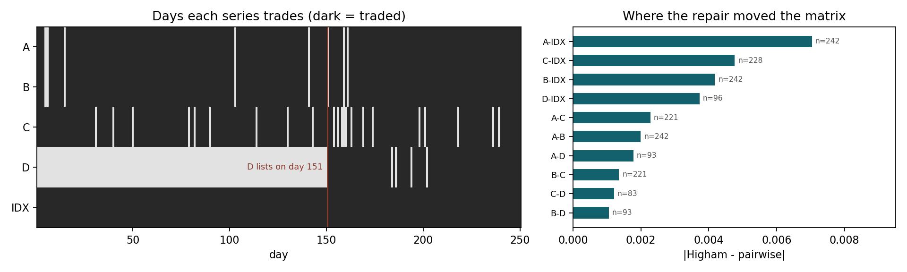
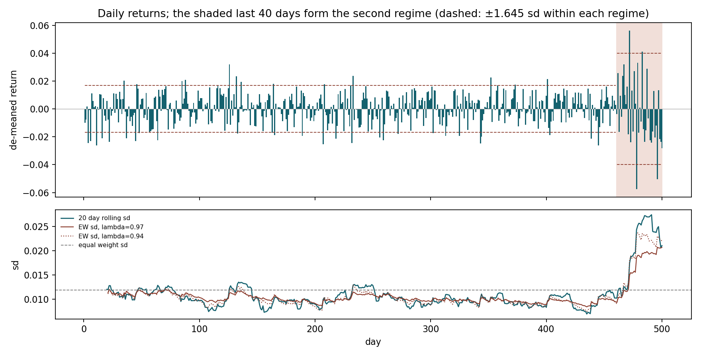
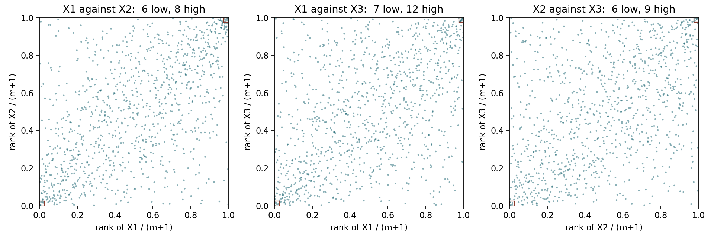
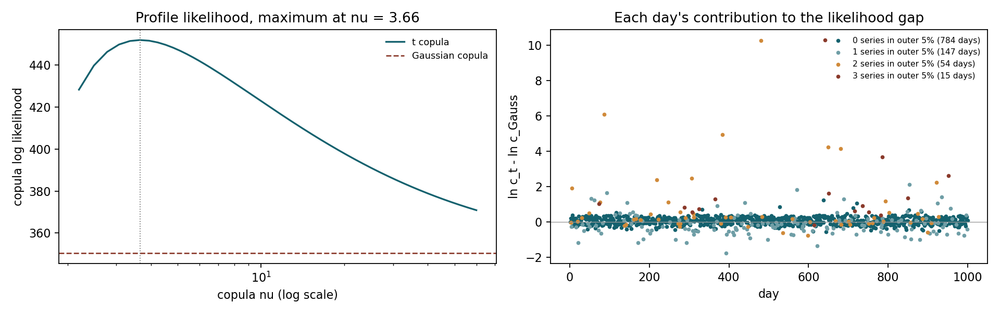

# Conventions

Every number quoted here comes from the output of the script named at the head
of its section, and every figure is written by the same script. `README.md` gives the
commands, and `output/` holds the saved console output.

* **VaR and ES** are reported as positive numbers for a loss, at
  $\alpha = 5\%$ unless stated. A negative VaR means the $\alpha$ quantile of
  the P&L is still a profit. The historical quantile follows the class
  implementation (`library/RiskStats.jl`): sort the P&L and average the order
  statistics at $\lfloor n\alpha \rfloor$ and $\lceil n\alpha \rceil$. ES is
  minus the mean of every P&L at or below that point.
* **Moments.** Variance with the $n-1$ divisor; skewness and kurtosis bias
  corrected; kurtosis in *excess* form, so a normal gives 0.
* **Returns** are arithmetic, from `riskmgmt.return_calculate`.
* **Exponentially weighted variance** is `riskmgmt.ew_covar`, the class
  estimator: weights $(1-\lambda)\lambda^{i-1}$ normalized to sum to 1, and the
  *weighted* mean removed before squaring.
* **AICc** counts every fitted parameter: $k = 2$ for a normal margin, $k = 3$
  for a $t$ margin. For the copulas the margins are frozen first and only the
  copula's own parameters count: $k = 0$ for the Gaussian, $k = 1$ ($\nu$) for
  the $t$, with $R$ held at the same Kendall estimate for both (Week 05).
  $\text{BIC} = k\ln m - 2\ell$.
* **Simulations** use fixed seeds and 100,000 draws. Where two models are
  compared, they share their random numbers, so the difference between them is
  the model and not the draw. Where a comparison is close, its simulation
  standard error is estimated from ten batches of 10,000.

The Week 03 machinery comes from the repository's `riskmgmt` library, which
passes functional tests 1.1--7.6. Problem 2 turned up a bug in its
`fit_general_t`: on de-meaned data the location started at about $10^{-19}$,
scipy's Nelder--Mead stepped it by 5% of that, and the location never moved.
It returned $\nu = 8.36$ where the true MLE is $8.27$. The fix is a separate
commit and all 25 tests still pass.

\newpage

# Correlations from Mismatched Histories

*Code: `problem1.py`.*

## Predict

| | A | B | C | D | IDX |
|:--|--:|--:|--:|--:|--:|
| A | 242 | 242 | 221 | 93 | 242 |
| B | | 242 | 221 | 93 | 242 |
| C | | | 228 | 83 | 228 |
| D | | | | 96 | 96 |
| IDX | | | | | 250 |

: Days each pair of series is jointly observed {#tbl-p1counts}

**All five trade on 81 of the 250 days**, and every one of those days is from
day 151 on, because D lists on day 151 (@fig-p1). C misses 22 days on its
foreign calendar, A and B miss 8.

{#fig-p1 width=100%}

**(a) Which estimator can return a matrix that is not PSD?**

**Pairwise can; complete case cannot.** The complete case matrix is the
correlation of one $81 \times 5$ data matrix $X$. Standardize its columns to
get $Z$; then $C = Z'Z/(n-1)$ and, for any vector $w$,

$$
w'Cw = \frac{\lVert Zw \rVert^2}{n-1} \geq 0 .
$$

That is the definition of PSD, and it holds by construction. The pairwise
matrix has no single $X$ behind it. Entry $(i,j)$ comes from the rows where
$i$ and $j$ both trade, so the ten entries come from ten different samples, and
nothing forces them to be consistent with each other. A set of inconsistent
correlations is exactly what a negative eigenvalue is (Week 03).

**(b) What does the near linear dependence of IDX imply?**

Let $w = (-0.4, -0.3, -0.2, -0.1, 1)$ be long IDX and short the basket. Its
variance is the tracking error variance, which is small. In correlation units
the same portfolio is $v = w \circ \sigma / \lVert w \circ \sigma \rVert$, and

$$
v'Cv = \frac{\operatorname{var}(w'r)}{\lVert w \circ \sigma \rVert^2}
\geq \lambda_{\min}(C)
$$

because the smallest eigenvalue is the minimum of $v'Cv$ over unit vectors.
The tracking variance can be measured directly on the 81 complete rows with no
correlation estimate at all: $3.22 \times 10^{-7}$, a tracking error of 5.7
basis points a day. On the same rows $\lVert w \circ \sigma \rVert^2 =
2.11 \times 10^{-4}$, so **the smallest eigenvalue of the true matrix is at
most about 0.0015**.

That number is the margin for error. An estimated matrix $\hat C = C + E$ has
$v'\hat C v = v'Cv + v'Ev$, so any error with $v'Ev < -0.0015$ in the tracking
direction produces a negative eigenvalue. The pairwise entries carry sampling
errors of 0.06 to 0.11 each (next part), and $v'Ev$ sums ten of them weighted by
$v_iv_j$, which reaches 0.36 for the A--IDX entry. **This data set is about as
exposed as it could be. I expect the pairwise matrix to be non-PSD, with the
negative eigenvector pointing along the tracking portfolio.**

**(c) Which correlations are least reliable?**

**The four involving D, and C--D worst of all.** A correlation's standard error
is about $(1-\rho^2)/\sqrt n \leq 1/\sqrt n$: 0.064 for anything among A, B and
IDX, 0.10 for D's pairs, and 0.110 for C--D on 83 days. There is a second
problem on top of the sample size. D's entries are estimated on days 151--250
only, while every other entry uses most of the 250 days. If the correlations
changed over the year, D's row describes a different period from the rest of
the matrix, and that is a source of inconsistency that no amount of data in the
other entries can fix.

## Fit

**(d) Both matrices, their eigenvalues, and a Cholesky of each.**

| | A | B | C | D | IDX |
|:--|--:|--:|--:|--:|--:|
| A | 1 | 0.4686 | 0.4309 | 0.4384 | 0.8696 |
| B | 0.3967 | 1 | 0.4630 | 0.2767 | 0.7329 |
| C | 0.2466 | 0.3169 | 1 | 0.1846 | 0.7136 |
| D | 0.4136 | 0.2361 | 0.1852 | 1 | 0.6057 |
| IDX | 0.8714 | 0.6709 | 0.5648 | 0.5719 | 1 |

: Complete case (below the diagonal) and pairwise (above) {#tbl-p1corr}

| | $\lambda_1$ | $\lambda_2$ | $\lambda_3$ | $\lambda_4$ | $\lambda_5$ |
|:--|--:|--:|--:|--:|--:|
| Complete case | $0.001506$ | $0.5483$ | $0.6933$ | $0.8704$ | $2.8864$ |
| Pairwise | $\mathbf{-0.011072}$ | $0.4714$ | $0.5284$ | $0.8574$ | $3.1539$ |

: Eigenvalues, smallest first {#tbl-p1eig}

* **Complete case: the Cholesky succeeds.** The smallest eigenvalue is 0.0015,
  just under the bound of 0.001525 from part (b), and positive.
* **Pairwise: the Cholesky fails**, in numpy and in the PSD tolerant
  `chol_psd`, at the last pivot, IDX, with a value of $-0.0164$. A Cholesky
  pivot is the variance of a variable left over after regressing it on the
  variables before it, so the pairwise correlations say A through D explain
  101.6% of the variance of IDX. That is the inconsistency, stated as a
  regression.

The eigenvector carrying the negative eigenvalue is
$(-0.394, -0.234, -0.267, -0.209, 0.822)$, and the tracking portfolio in
correlation units is $(-0.439, -0.238, -0.244, -0.152, 0.817)$. **The cosine
between them is 0.997.** The prediction in (b) holds: the failure is the
tracking portfolio.

**(e) Tracking portfolio variance from the pairwise matrix.**

Using each series' full history standard deviation (A 0.016502, B 0.011919,
C 0.018324, D 0.022829, IDX 0.012281) and $\Sigma = DCD$:

$$
w'\Sigma w = -1.80 \times 10^{-6}.
$$

**A negative variance.** Measured directly on the complete rows, the same
portfolio has a variance of $+3.22 \times 10^{-7}$.

**(f) The two repairs.**

| Repair | Smallest eigenvalue | $\lVert \cdot - C_{pw} \rVert_F$ | $w'\Sigma w$ |
|:--|--:|--:|--:|
| Rebonato--Jackel | $-7.5 \times 10^{-17}$ | $0.016182$ | $6.81 \times 10^{-7}$ |
| Higham | $-9.9 \times 10^{-10}$ | $\mathbf{0.015520}$ | $6.79 \times 10^{-7}$ |

: The two repairs of the pairwise matrix {#tbl-p1repair}

Both repairs set the negative eigenvalue to zero, up to rounding. Higham is
4% closer to the original, as it must be, since it is the nearest PSD
correlation matrix in the Frobenius norm. The two repaired matrices are only
$0.0046$ apart. The tracking variance is now positive and about twice the
direct measurement.

One practical consequence: the nearest PSD matrix to a non-PSD one sits on the
boundary of the PSD set, so the repair is **singular**. numpy's Cholesky still
fails on the Higham result, and `chol_psd` succeeds with 4 non-zero columns. To
simulate from it you need the PSD Cholesky or a small ridge.

## Reconcile

**(g) Explain (e) with the definition of PSD.**

Week 02 defines $\Sigma$ as PSD when $w'\Sigma w \geq 0$ for every $w$. The
reason that is the definition is that $w'\Sigma w$ is the variance of portfolio
$w$, and no portfolio of real assets has a negative variance. The pairwise
matrix fails the definition for exactly one direction, its negative
eigenvector, and part (d) showed that direction is the tracking portfolio. So
the matrix is not the covariance of any possible set of returns. It claims the
hedge is better than perfect.

The data put the error in the worst place. The tracking portfolio is the one
portfolio whose true variance is nearly zero, so it has almost no room for
estimation error before going negative. It is also the portfolio a hedger
actually holds.

**(h) Which entries did Higham move most?**

| Pair | Days | Pairwise | Higham | Change | $v_iv_j$ |
|:--|--:|--:|--:|--:|--:|
| A--IDX | 242 | 0.8696 | 0.8625 | $-0.0070$ | $-0.324$ |
| C--IDX | 228 | 0.7136 | 0.7088 | $-0.0048$ | $-0.219$ |
| B--IDX | 242 | 0.7329 | 0.7287 | $-0.0042$ | $-0.192$ |
| D--IDX | 96 | 0.6057 | 0.6020 | $-0.0037$ | $-0.171$ |
| A--C | 221 | 0.4309 | 0.4332 | $+0.0023$ | $+0.105$ |
| A--B | 242 | 0.4686 | 0.4706 | $+0.0020$ | $+0.092$ |
| A--D | 93 | 0.4384 | 0.4402 | $+0.0018$ | $+0.082$ |
| B--C | 221 | 0.4630 | 0.4644 | $+0.0014$ | $+0.062$ |
| C--D | 83 | 0.1846 | 0.1858 | $+0.0012$ | $+0.056$ |
| B--D | 93 | 0.2767 | 0.2777 | $+0.0011$ | $+0.049$ |

: Entries moved by the Higham repair, largest first. $v$ is the negative eigenvector. {#tbl-p1moves}

**The four IDX correlations, every one lowered.** All six stock--stock
correlations rose. The entries I named least reliable in (c), C--D and B--D,
moved the *least* of all ten. Across the ten pairs the size of the change is
negatively correlated with $1/n$ ($-0.48$): the repair moved the entries with
more data behind them further.

That is because the repair was never told about the data. It sees only the
matrix, and it fixes the matrix along its geometry. With one negative
eigenvalue, clipping it changes entry $(i,j)$ by about $-\lambda v_iv_j$, and
the correlation between the size of each change and $\lvert v_iv_j \rvert$ is
1.0000. The eigenvector is dominated by IDX (loading 0.82), because IDX carries
weight 1 in the tracking portfolio and no stock carries more than 0.4. So IDX's
row absorbs the repair. Both directions of the change make sense: lowering
IDX's correlations reduces how much of IDX the basket explains, and raising the
stock correlations raises the basket's own variance. Both push the tracking
variance back up through zero.

The repair is a statement about *where the inconsistency sits*, which is the
tracking direction. It is not a statement about which entries are wrong. If the
error is in D's row, as (c) suggested, the repair fixed it by changing IDX's
row. Higham's weighted norm can be pointed at the less reliable entries, but
only with weights the user supplies.

**(i) Repair against estimator: which decision matters more?**

$$
\lVert C_{cc} - C_{pw} \rVert_F = 0.4239 \qquad
\lVert C_{\text{Higham}} - C_{pw} \rVert_F = 0.0155 \qquad
\lVert C_{\text{RJ}} - C_{\text{Higham}} \rVert_F = 0.0046
$$

**The choice of estimator matters 27 times more than whether to repair, and 90
times more than which repair.** The largest gaps between the two estimators are
all C's correlations: A--C $-0.184$, C--IDX $-0.149$, B--C $-0.146$.

The reason is that the complete case is also a choice of time window. Its 81
rows are all from days 151--250. Splitting the long-history pairs at day 151:

| Pair | Days 1--150 | Days 151--250 | Fisher $z$ |
|:--|--:|--:|--:|
| A--B | 0.489 | 0.417 | 0.68 |
| A--C | 0.532 | 0.270 | **2.25** |
| B--C | 0.515 | 0.378 | 1.22 |
| A--IDX | 0.879 | 0.854 | 0.75 |
| C--IDX | 0.785 | 0.580 | **2.86** |

: Correlations before and after D lists {#tbl-p1split}

C's correlations fell by a margin unlikely to be noise. The pairwise matrix
mixes C's high first half correlations into its C entries with D's entries,
which only exist in the low second half. That mixture of windows is a plausible
source of the inconsistency in (d), and it is something no repair can see. So
the first decision is which period the matrix is meant to describe. The repair
is a 0.016 adjustment applied after that decision has already moved the matrix
by 0.42.

\newpage

# A Volatility Estimate After the Regime Changed

*Code: `problem2.py`.*

## Predict

{#fig-p2 width=100%}

The plot shows one feature: **the last 40 or so days swing about twice as wide
as the 460 before them**, with no build up. The calm period looks the same from
beginning to end.

**(a) Rank the five VaR estimates before computing them.**

My ranking, smallest to largest:

1. **Student's $t$.** It is fitted to all 500 days, so it sees one distribution
   whose tails are fat because two regimes are pooled. A fat tailed
   distribution fitted to the same data puts more mass in the centre and the far
   tails and less at the shoulders, and 5% is a shoulder. At the same variance
   its 5% quantile should sit slightly inside the normal's.
2. **Normal, equal weight.** The full sample standard deviation, 92% calm days.
3. **Historical.** The 5% quantile is the 25th worst of 500 days. The volatile
   days are 8% of the sample, and I expected them to crowd the worst 5% and
   push this just above the normal. Steps 1 to 3 should be close together.
4. **Normal, $\lambda = 0.97$.** Most of its weight is on the new regime (next
   part), so it should be near the new regime's level, but it still carries
   some calm days.
5. **Normal, $\lambda = 0.94$.** Almost all of its weight is on the new regime.

The first three are full sample estimates and the last two are recent ones, so
I expected a wide gap between steps 3 and 4.

**(b) Effective sample size, half life, and weight on the recent days.**

| $\lambda$ | $n_{\text{eff}}$ | Half life (days) | Weight on the last 40 days |
|--:|--:|--:|--:|
| 0.97 | 65.67 | 22.76 | 0.704 |
| 0.94 | 32.33 | 11.20 | 0.916 |
| equal | 500 | --- | 0.080 |

: Exponential weights over $n = 500$ returns {#tbl-p2weights}

$n_{\text{eff}}$ equals $(1+\lambda)/(1-\lambda)$ to two decimals, because
$\lambda^{500}$ is negligible and the finite weights behave like infinite ones.
From the plot I put the regime change **40 days** before the end. A maximum
likelihood changepoint scan, splitting the sample into two variances, puts it
at 39, and the weights on 39 days (0.695 and 0.910) barely differ.

**(c) Moments of the full sample. Could one normal regime produce them?**

Mean zero (removed), standard deviation 0.011912, skewness $-0.156$, excess
kurtosis $+2.166$. Under normality the excess kurtosis has a standard error of
about $\sqrt{24/n} = 0.219$, so 2.17 is **9.9 standard errors from zero**, and
Jarque--Bera rejects at $p = 10^{-21}$. **No, one normal regime could not
produce these.** My prediction is that two normal regimes with different
variances can: a mixture of normals with different variances has positive
excess kurtosis even when neither component has fat tails.

## Fit

**(d) The five VaRs on \$1,000,000.**

| Method | Standard deviation used | VaR |
|:--|--:|--:|
| Student's $t$ (MLE) | 0.011818 (implied) | \$18,872 |
| Normal, equal weight | 0.011912 | \$19,594 |
| Historical simulation | --- | \$20,574 |
| Normal, EW $\lambda = 0.97$ | 0.020709 | \$34,064 |
| Normal, EW $\lambda = 0.94$ | 0.022074 | \$36,308 |

: Five one day 5% VaR estimates, smallest first {#tbl-p2var}

Fitted $t$: location $\mu = 0.000182$, scale $\sigma = 0.010290$,
$\nu = 8.270$. Its implied standard deviation is
$\sigma\sqrt{\nu/(\nu-2)} = 0.011818$.

## Reconcile

**(e) Compare with the ranking.**

**The order came out exactly as predicted, but one of the five landed there for
a reason I had wrong.**

The $t$ sits below the normal for the reason given. Standardized to unit
variance, the 5% quantile of a $t_{8.27}$ is $-1.612$ against the normal's
$-1.645$. The fitted location is also slightly positive, which removes another
\$182.

The historical estimate is above the normal, as predicted, but **not because
the volatile days crowd the tail**. Only 10 of the 25 worst days are from the
last 40. The better way to check is to ask what historical simulation is
estimating if the two regime picture is right. That is the 5% quantile of a
92/8 mixture of $N(0, 0.0102^2)$ and $N(0, 0.0243^2)$, which is **\$18,455,
below the normal** and close to the $t$. The mixture is a fat tailed
distribution, and at 5% a fat tailed distribution has the smaller quantile for
the same reason the $t$ does. The standard error of a 5% sample quantile from
500 days is about \$1,226, and the historical figure is 1.73 of those above the
mixture value. So historical landing above the normal is sampling luck on the
25th order statistic. The correct prediction was "near the $t$", and I would
have put it second, not third.

The two exponentially weighted estimates sit where predicted. The two regime
picture says they should be
$\sqrt{0.296 s_1^2 + 0.704 s_2^2} = 0.0211$ and
$\sqrt{0.084 s_1^2 + 0.916 s_2^2} = 0.0234$, against the 0.0207 and 0.0221
actually estimated.

**(f) Standard deviation in each regime, and what the $t$ is describing.**

| | Days | Standard deviation | Excess kurtosis | Normal VaR |
|:--|--:|--:|--:|--:|
| Calm | 460 | 0.010178 | $-0.20$ | \$16,741 |
| Recent | 40 | 0.024289 | $+0.03$ | \$39,952 |

: The two regimes {#tbl-p2regimes}

Volatility rose by a factor of 2.39, and **inside each regime the returns are
not fat tailed at all**. Both excess kurtoses are within about one standard
error of zero. The excess kurtosis of the full sample comes entirely from
pooling the two. A 92/8 mixture of two zero mean normals at these standard
deviations has

$$
\text{excess kurtosis} = \frac{3\left((1-p)s_1^4 + p\, s_2^4\right)}{\left((1-p)s_1^2 + p\, s_2^2\right)^2} - 3 = 2.57,
$$

with a standard deviation of 0.011937. The sample has 2.17 and 0.011912.

**The fitted $t$ is describing the pooled, unconditional distribution of the
last 500 days**: a calm period and a volatile one, averaged into one fat tailed
shape. Its standard deviation, 0.0118, matches neither regime. It answers
"what does a randomly chosen day of the last two years look like" correctly,
and "what does tomorrow look like" badly. Its VaR of \$18,872 is less than half
the \$39,952 a normal VaR gives at the current regime's volatility. Fitting a
fatter tailed distribution to the full sample did not get closer to the current
risk; it moved further away.

**(g) Is the gap between the two EW VaRs larger than the noise?**

| $\lambda$ | $1/\sqrt{2 n_{\text{eff}}}$ | Standard error of the VaR |
|--:|--:|--:|
| 0.97 | 8.7% | \$2,972 |
| 0.94 | 12.4% | \$4,515 |

: Estimation noise in each EW VaR {#tbl-p2se}

**No.** The gap is \$2,244, smaller than either standard error. Two caveats,
which pull in opposite directions. The two estimates use the same days, so
their errors are positively correlated and the noise in their *difference* is
smaller than either standard error. But part of the gap is systematic rather
than noise: $\lambda = 0.97$ still puts 30% of its weight on the calm regime,
which the two regime picture says is worth \$3,799 by itself. Separately,
the convention for the mean moves the numbers as much as $\lambda$ does.
Squaring around zero instead of the weighted mean gives \$38,707 at 0.94,
\$2,399 higher, because the recent days have a negative weighted mean.

*My opinion:* **for a trading limit, $\lambda = 0.94$.** A limit exists to
react, the change is 40 days old, and an estimator with a 23 day half life is
still averaging in a regime that has ended. **For a capital number, 0.97**, as
Week 03 suggests, because capital should not jump with every fortnight of data,
and here it costs only 6.2% against 0.94. The more important point for
capital is what not to use. The equally weighted, $t$, and historical numbers
are all near \$19,000--21,000, half the current regime's risk, and none of them
should stand after a regime change this clear.

\newpage

# When Diversification Raises VaR

*Code: `problem3.py`.*

## Predict

{#fig-p3 width=100%}

**(a) Moments, and what they say about a normal VaR.**

| Bond | Mean | SD | Skewness | Excess kurtosis | Min | Median | Max |
|:--|--:|--:|--:|--:|--:|--:|--:|
| A | 0.0837 | 0.1360 | $-4.82$ | $22.09$ | $-0.830$ | 0.1106 | 0.152 |
| B | 0.0850 | 0.1321 | $-4.92$ | $23.09$ | $-0.856$ | 0.1105 | 0.154 |

: Moments of each bond's one year return {#tbl-p3moments}

These are the moments of a **two point mixture, not of anything bell shaped.**
About 96% of scenarios sit tightly around $+11.1\%$, the $100/90 - 1$ a bond
earns when it pays, and about 4% sit between $-20\%$ and $-86\%$, the defaults.
There is nothing in between: A's largest negative return is $-0.219$ and its
smallest non-negative one is $+0.069$. The skewness of $-4.8$ is that 4% cluster
far to the left, and the kurtosis of 22 is the distance between the clusters.

**A normal VaR on these positions is meaningless.** It uses only the mean and
standard deviation, so it describes a single hump centred at 8.4% with a 13.6%
spread. For \$1,000,000 in A it puts the 5% quantile at a loss of 14%, a region
where not one of the 10,000 scenarios lies. It cannot know that the 5% point
sits on a cliff edge.

**(b) Counts, and a prediction for VaR and ES.**

| Event | Scenarios | Share |
|:--|--:|--:|
| A loses more than 20% | 406 | 4.06% |
| B loses more than 20% | 393 | 3.93% |
| At least one does | 782 | 7.82% |
| Both do | 17 | 0.17% |
| Both, if independent | 16.0 | |

: Scenarios with a loss of more than 20% {#tbl-p3counts}

The defaults look independent: 17 joint against 16.0 expected, and a return
correlation of 0.002. (One of B's 394 defaults lost only 19.6%, so the defaults
number 406, 394 and 783. It changes nothing below.)

The 5% tail of 10,000 scenarios is the worst 500, and 500 sits between the
counts.

* **VaR: the diversified choice has the larger VaR.** Concentrated in A, only
  406 scenarios are defaults, fewer than 500, so the 500th worst scenario is a
  bond that paid. Its VaR will be *negative*, a profit. Diversified, 782
  scenarios contain a default, more than 500, so the 500th worst contains one
  default and VaR will be a large loss, roughly \$1,000,000 times a default
  loss of 55% less the other bond's 11% gain.
* **ES: the diversified choice has the smaller ES.** ES averages the worst 500
  scenarios, so it sees the defaults that VaR skips. Concentrated, 406 of the
  500 are a default on the whole \$2,000,000. Diversified, all 500 contain a
  default, but almost all of them (483) are a default on half the money, offset
  by the other bond's gain. Roughly $0.81 \times \$2\text{M} \times 0.55$
  against $\$1\text{M} \times (0.55 - 0.11)$: about \$900,000 against \$450,000.

## Fit

**(c) Historical VaR and ES at 5%, (d) normal VaR, (e) historical at 1%.**

| Position | VaR 5% | ES 5% | Normal VaR 5% | VaR 1% | ES 1% |
|:--|--:|--:|--:|--:|--:|
| \$1M in A | $-$\$84,531 | \$443,628 | \$139,971 | \$650,545 | \$709,548 |
| \$1M in B | $-$\$86,011 | \$419,587 | \$132,277 | \$641,248 | \$700,805 |
| \$2M in A | $-$\$169,061 | \$887,257 | \$279,941 | \$1,301,090 | \$1,419,096 |
| \$1M in each | **\$414,767** | **\$541,997** | \$143,466 | **\$598,237** | **\$716,408** |

: VaR and ES of the four positions. The normal VaR uses each P&L's sample mean and standard deviation. {#tbl-p3risk}

Both predictions hold. At 5%, VaR prefers the concentrated position by
\$583,828, and ES prefers the diversified one by \$345,260.

## Reconcile

**(f) Subadditivity at 5%.**

| Measure | $q(A) + q(B)$ | $q(A + B)$ | Subadditive? |
|:--|--:|--:|:--|
| VaR 5% | $-$\$170,542 | \$414,767 | **no** |
| ES 5% | \$863,216 | \$541,997 | yes |
| VaR 1% | \$1,291,793 | \$598,237 | yes |
| ES 1% | \$1,410,353 | \$716,408 | yes |
| Normal VaR 5% | \$272,247 | \$143,466 | yes |

: $q(A) + q(B) \geq q(A+B)$, with the two \$1,000,000 positions {#tbl-p3sub}

**VaR fails subadditivity at 5%; ES does not.** Holding both bonds is measured
as \$585,309 riskier than the sum of holding each.

The mechanism is the Week 04 bond example, at scale. VaR reads one point, the
500th worst scenario, and is blind to everything beyond it. Each bond on its own
defaults in about 4% of scenarios, so its default sits entirely beyond the 5%
point, where VaR cannot see it, and VaR reports a profit. Combining the bonds
does not make any default more likely. It makes *some* default more likely:
7.8% of scenarios contain at least one, and that moves default mass across the
5% threshold. The worst 500 scenarios of the combined position are 483 single
defaults and 17 double defaults. VaR then reports a single default in full.
Nothing about the bonds changed; the quantile moved from one side of a cliff to
the other.

ES is subadditive because it averages *every* scenario in the tail. It sees the
406 defaults in A's tail that VaR skipped, so the single bond ES figures are
already large, and spreading the money over two independent bonds really does
lower the average tail loss.

**(g) The normal VaR says diversification helps. Is it right for the right
reason?**

It favours **the diversified position**, \$143,466 against \$279,941, and it is
subadditive. Under normality VaR is $1.645\sigma$ less the mean, and $\sigma$
is subadditive, so this outcome is guaranteed whatever the data look like. The
correlation is 0.002, so the diversified standard deviation is close to
$1/\sqrt 2$ of the concentrated one, and that is the whole calculation.

**It reaches the right choice for the wrong reason.** The diversified position
is the better one, because it has the lower ES and the lower 1% VaR. But every
number the normal produces is wrong:

* it says the single bond VaR is a loss of \$139,971, when 95% of scenarios are
  a profit of at least \$84,531;
* it says the diversified VaR is \$143,466, when it is \$414,767, under by a
  factor of 2.9;
* it gets the ranking right only because it measures risk by standard deviation,
  which diversification always lowers. It has no idea where the defaults are.

A model that would have chosen the diversified position for *any* pair of
uncorrelated assets has not discovered anything about these two.

**(h) Why does the result change at 1%?**

At 1% the tail is the worst 100 scenarios, and now every quantile sits beyond
the default threshold. For \$2,000,000 in A, all 100 are defaults, and VaR is a
loss of \$1,301,090. For the diversified position, the worst 100 are 83 single
and 17 double defaults, and VaR is \$598,237, less than half. VaR is
subadditive again, by a wide margin, and agrees with ES.

So **VaR's failure shows up only when $\alpha$ falls between the probability of
the bad event in the separate positions and its probability in the combined
one**, here between about 4% and 7.8%. Above 7.8%, no quantile sees a default.
Below 4%, every quantile does. In between, diversification moves the event
across the threshold and VaR punishes it. That makes the failure a property of
the level chosen as much as of VaR, and the dangerous case is the one here: a
rare, large loss whose probability sits just beyond the confidence level, which
is exactly what credit portfolios and short option books look like.

\newpage

# Gaussian or $t$ Copula

*Code: `problem4.py`.*

## Predict

**(a) Moments, and a margin for each series.**

| Series | Mean | SD | Skewness | Excess kurtosis | Skewness, day 952 removed | Kurtosis, day 952 removed |
|:--|--:|--:|--:|--:|--:|--:|
| X1 | 0.000257 | 0.011894 | $-0.034$ | $-0.117$ | $-0.006$ | $-0.188$ |
| X2 | $-0.000252$ | 0.016168 | $\mathbf{-0.615}$ | $\mathbf{7.125}$ | $+0.056$ | $1.725$ |
| X3 | 0.000890 | 0.010019 | $0.074$ | $2.874$ | $+0.313$ | $1.731$ |

: Moments of each series, and the same with the most extreme day removed {#tbl-p4moments}

Standard errors under normality are about 0.077 for skewness and 0.155 for
excess kurtosis at $m = 1000$.

* **X1: normal.** Both shape moments are within one standard error of zero.
* **X2: $t$, symmetric.** Its skewness of $-0.62$ and kurtosis of $7.1$ look
  out of place. **Both rest on one day.** Day 952 is a return of $-0.143$, an
  $8.8\sigma$ move. Without it the skewness is $+0.06$, gone, and the kurtosis
  falls to 1.72, still 11 standard errors above zero. X2 is fat tailed, but not
  skewed, and not as fat tailed as the full moment says.
* **X3: $t$.** Excess kurtosis 2.87, or 1.73 without its own extreme day.

Day 952 is the most extreme day of **all three series**, and each one's
smallest return of the 1,000. One day on which every series has its worst day
of the sample is the joint tail event this problem is about, before any copula
is fitted.

**(b) Ranks, joint tail counts, and a prediction.**

{#fig-p4ranks width=100%}

| Pair | Kendall $\tau$ | $\sin(\pi\tau/2)$ | Both in worst 2.5% | Both in best 2.5% | Gaussian at that $\rho$ |
|:--|--:|--:|--:|--:|--:|
| X1--X2 | 0.396 | 0.583 | 6 | 8 | 5.93 |
| X1--X3 | 0.335 | 0.503 | 7 | 12 | 4.66 |
| X2--X3 | 0.307 | 0.464 | 6 | 9 | 4.14 |
| Total | | | 19 | 29 | 14.73 |

: Joint tail days out of 1,000 {#tbl-p4counts}

**Under independence each pair would share $1000 \times 0.025^2 = 0.625$ days
per tail.** Every count is ten to twenty times that, but that only says the
series are correlated, which the plots already show. The useful benchmark is a
Gaussian copula at the same correlation: the last column is the expected count
in each tail, computed from the bivariate normal at $\rho = \sin(\pi\tau/2)$.
The data have **48 joint tail days against 29.5** expected under that
Gaussian.

Is the tail more connected than the middle? Repeating the comparison at less
extreme cut-offs:

| Cut-off $q$ | 25% | 10% | 5% | 2.5% |
|:--|--:|--:|--:|--:|
| Observed / Gaussian | 1.04 | 1.11 | 1.17 | **1.63** |

: Joint exceedances relative to a Gaussian copula at the same correlation, three pairs and both tails {#tbl-p4ratio}

The excess over the Gaussian **grows as the cut-off moves into the tail**: 4%
at the quartiles and 63% at 2.5%. The plots show the same thing, a
concentration of points in the two corners beyond what the elliptical cloud in
the middle would suggest. Add day 952, and **I predict the $t$ copula wins**,
clearly.

## Fit

**(c) Normal or $t$ for each margin, by AICc.**

| Series | $\ell$ normal | $\ell$ $t$ | AICc normal | AICc $t$ | $\hat\nu$ | Choice |
|:--|--:|--:|--:|--:|--:|:--|
| X1 | 3013.274 | 3013.274 | $\mathbf{-6022.54}$ | $-6020.52$ | $> 1000$ | normal |
| X2 | 2706.253 | 2762.104 | $-5408.49$ | $\mathbf{-5518.18}$ | 5.27 | $t$ |
| X3 | 3184.851 | 3217.020 | $-6365.69$ | $\mathbf{-6428.02}$ | 6.09 | $t$ |

: Margin selection, $k = 2$ for the normal and 3 for the $t$ {#tbl-p4margins}

As predicted. For X1 the $t$ drives $\nu$ to infinity and gains nothing in
likelihood, so the extra parameter loses on AICc by 2.01. X2's $t$ has
$\nu = 5.27$, and refitted without day 952 it is $6.04$: unlike the moments, the
fitted $t$ barely depends on the one observation.

**(d) The copulas.**

Each series goes to uniforms through its chosen margin. $R = \sin(\pi\tau/2)$
from Kendall's $\tau$ on those uniforms is the matrix in @tbl-p4counts, since
$\tau$ is a rank statistic. Its smallest eigenvalue is 0.413, so no repair was
needed.

| | Gaussian | $t$ |
|:--|--:|--:|
| Log likelihood $\ell$ | 350.454 | 451.999 |
| Free parameters $k$ | 0 | 1 |
| $\hat\nu$ | --- | 3.659 |
| AICc | $-700.91$ | $\mathbf{-901.99}$ |
| BIC | $-700.91$ | $\mathbf{-897.09}$ |

: Gaussian and $t$ copula, same uniforms and same $R$, $m = 1000$ {#tbl-p4cop}

$$
\Delta\text{BIC} = 2(\ell_t - \ell_{\text{Gauss}}) - \ln m = 203.09 - 6.91 = 196.18
$$

{#fig-p4fit width=100%}

**(e) Portfolio VaR and ES, \$1,000,000 in each.**

| | VaR 5% | ES 5% | VaR 1% | ES 1% |
|:--|--:|--:|--:|--:|
| Gaussian copula | \$49,477 | \$66,218 | \$75,971 | \$93,561 |
| $t$ copula | \$48,656 | \$67,924 | \$77,981 | \$101,412 |
| Historical | \$47,939 | \$65,699 | \$70,092 | \$102,424 |
| *$t$ minus Gaussian* | $-$\$821 | +\$1,706 | +\$2,010 | **+\$7,851** |
| *standard error of the difference* | \$297 | \$371 | \$339 | \$1,315 |

: Portfolio risk from 100,000 simulated days through the fitted margins, and historically {#tbl-p4risk}

The two simulations share their normal draws, so the standard error of their
difference is small. Each number on its own carries a simulation standard error
of \$260--\$1,100.

**(f) Joint tail days implied by each copula, per 1,000 days.**

| Pair | Data, worst | Data, best | Gaussian, worst | Gaussian, best | $t$, worst | $t$, best |
|:--|--:|--:|--:|--:|--:|--:|
| X1--X2 | 6 | 8 | 5.70 | 5.52 | 9.02 | 9.07 |
| X1--X3 | 7 | 12 | 4.80 | 4.63 | 7.77 | 7.89 |
| X2--X3 | 6 | 9 | 4.18 | 3.97 | 7.18 | 7.01 |
| Total | 19 | 29 | 14.68 | 14.12 | 23.97 | 23.97 |

: Joint 2.5% tail days, observed and implied {#tbl-p4tails}

## Reconcile

**(g) Which copula wins, and by how much?**

**The $t$, overwhelmingly: $\Delta\text{BIC} = 196$, $\Delta\text{AICc} =
201$.** A BIC difference above 10 is already strong evidence. This one says the
data are about $e^{101.5} \approx 10^{44}$ times more likely under the $t$. The
profile in @fig-p4fit is sharply peaked at $\hat\nu = 3.66$, and the
likelihood is within 1.92 units of its maximum only for $\nu$ from 3.10 to
4.43. Unlike the five stock example in Week 05, $\nu$ is well identified here,
and it is low.

The joint tail counts agree. Over both tails the data have **48 days; the $t$
implies 47.9 and the Gaussian 28.8.** Treating the count as Poisson, 48 or more
has probability 0.0007 under the Gaussian and 0.52 under the $t$. (The three
pairs share series, so the Poisson figure is approximate.)

One thing the $t$ does not match is the split. The data have 19 joint worst days
and 29 joint best, while the $t$ copula is symmetric and implies 24 of each. A
gap of 10 between two counts each near 24 is about 1.4 standard deviations, so
it is not evidence of asymmetry on its own. If it persisted, an asymmetric
family from the Archimedean group would be the next thing to try. Note too that
the lower tail alone, 19, is closer to the Gaussian's 14.7 than to the $t$'s 24.
It is the upper tail that most clearly rejects the Gaussian.

**(h) Which risk number moves most, and why does 5% VaR barely move?**

**1% ES**, up \$7,851 or 8.4%, six standard errors of the paired difference.
5% VaR moves by $-$\$821, $-1.7\%$, and in the *opposite* direction: the $t$
copula's 5% VaR is slightly *lower*.

Both copulas use the same $R$ and the same margins, so the portfolio standard
deviation is the same under each (\$31,179 against \$31,196). What the $t$
changes is where the probability sits for that variance. Its common shock puts
more days in which all three move far together, and to keep the variance the
same it pays for them with fewer moderately bad days. The 5% quantile sits near
the point where those two effects cancel, which is the Week 05 point that a
unit variance $t$ has nearly the normal's 5% quantile. Under the $t$ copula the
probability of losing more than the Gaussian's 5% VaR is 4.78%, not 5%. Further
out the picture reverses: the chance of exceeding the Gaussian's 1% VaR is
1.12%, and the 0.1% loss quantile is \$131,572 against \$114,661, 15% higher.
ES at 1% averages exactly the region where the copulas disagree most. VaR at 5%
reads one point in the region where they agree.

The historical 1% ES, \$102,424, is within one standard error of the $t$
copula's \$101,412 and well above the Gaussian's \$93,561. (The historical 1%
VaR is the 10th worst of 1,000 days and too noisy to compare.)

**(i) Where does $\ell_t - \ell_{\text{Gauss}}$ come from?**

| Series in their outer 5% | Days | Contribution | Share | Per day |
|:--|--:|--:|--:|--:|
| 0 | 784 | $+49.84$ | 49.1% | $+0.064$ |
| 1 | 147 | $-19.02$ | $-18.7\%$ | $-0.129$ |
| 2 | 54 | $+44.44$ | 43.8% | $+0.823$ |
| 3 | 15 | $+26.28$ | 25.9% | $+1.752$ |
| Total | 1,000 | $+101.55$ | | |

: Each day's $\ln c_t - \ln c_{\text{Gauss}}$, grouped by how many series sit in their outer 5% on either side (by rank) {#tbl-p4gain}

**Half the total, 49.8 of 101.5, comes from the 784 days on which no series is
in its outer 5%.** Each such day contributes little, 0.064, but there are many
of them. And within those days the gain is concentrated near the centre: the
half of them closest to the middle of the copula contributes $+48.2$, the outer
half $+1.7$. The $t$ copula with the same $R$ is more peaked in the centre than
the Gaussian, and the data are too. At the other end, the 147 days on which
exactly one series is extreme count *against* the $t$ by 19.0, because the $t$
says extremes come together and a lone extreme is less likely under it. Day 952
on its own contributes only 2.6.

**The information criterion is scoring the whole shape of the dependence, and
by number of days that is mostly the middle.** It is not a tail test. Here the
middle and the tails happen to agree, and part (f) confirmed the tails
separately. But a copula could win on AICc by fitting the peak in the centre
and still get the joint tail wrong, and the criterion would not say so. The
tail counts are the check the criterion cannot do. This is the Week 05 point
that almost all of the sample sits in the middle; here it can be measured, and
it is half.

**(j) Tail dependence for the most correlated pair.**

For X1--X2, $\rho = 0.583$ and $\hat\nu = 3.66$:

$$
\lambda = 2\,t_{\nu+1}\!\left(-\sqrt{\frac{(\nu+1)(1-\rho)}{1+\rho}}\right) = 0.322
$$

**Under the Gaussian copula it is 0**, as it is for every $\rho < 1$. The $t$
copula says that given X1 has a loss deep in its tail, there is about a one in
three chance that X2 does too, however deep the tail. Across the likelihood
range for $\nu$ in (g), $\lambda$ runs from 0.281 to 0.357. The other two pairs
have 0.273 and 0.253.

\newpage

# Model Based Simulation and Residual Correlation

*Code: `problem5.py`.*

## Predict

**(a) Does treating $\epsilon_A$ and $\epsilon_B$ as independent overstate or
understate the VaR of each portfolio?**

With $r_i = \alpha_i + \beta_i r_M + \epsilon_i$, the market uncorrelated with
each error, and $h$ dollars a side, the Week 02 portfolio variance formula gives

$$
\operatorname{var}(P1) = h^2\left[(\beta_A + \beta_B)^2\sigma_M^2 + \sigma_A^2 + \sigma_B^2 + 2\rho\,\sigma_A\sigma_B\right]
$$

$$
\operatorname{var}(P2) = h^2\left[(\beta_A - \beta_B)^2\sigma_M^2 + \sigma_A^2 + \sigma_B^2 - 2\rho\,\sigma_A\sigma_B\right]
$$

where $\sigma_A, \sigma_B$ are the residual standard deviations and $\rho$ is the
residual correlation. A shared industry the market does not capture shows up as
$\rho > 0$. The shortcut sets $\rho = 0$, which:

* removes a **positive** term from P1, so it **understates** P1's VaR;
* removes a **negative** term from P2, so it **overstates** P2's VaR.

I also expect P2 to be the more exposed. If the two betas are similar, the
market term nearly cancels in P2, so the residual terms are almost all of its
variance, and the covariance term is a large fraction of that.

## Fit

**(b) The two regressions.**

| Stock | $\alpha$ | $\beta$ | Residual SD ($n-2$) | Residual SD ($n-1$) | $R^2$ |
|:--|--:|--:|--:|--:|--:|
| A | 0.000205 | 1.0353 | 0.012901 | 0.012888 | 0.418 |
| B | 0.000315 | 0.9354 | 0.011550 | 0.011538 | 0.423 |

: OLS of each stock's daily arithmetic return on the market, $n = 500$ {#tbl-p5ols}

**The residual correlation is 0.698.** The market explains only about 42% of
each stock's variance, and what it leaves behind is strongly shared. That is the
shared industry. The market's standard deviation is 0.010553.

**(c) Simulated VaR under the two assumptions,** with
$[r_M, \epsilon_A, \epsilon_B] \sim N(0, \Sigma)$ and $\Sigma$ block diagonal,
the Week 05 construction. Expected returns are zero, so the alphas are dropped.
Both runs use the same random numbers. All covariances use the $n-1$ divisor,
to match (d).

| Residual covariance | P1 VaR | P2 VaR | P1 ES | P2 ES |
|:--|--:|--:|--:|--:|
| Full | \$50,298 | \$15,841 | \$63,152 | \$19,876 |
| Off diagonal set to 0 | \$44,450 | \$28,472 | \$55,712 | \$35,725 |

: One day 5% VaR from 100,000 simulated days {#tbl-p5sim}

**(d) Delta normal VaR** from the sample covariance of A and B:
**P1 \$50,415, P2 \$15,834.**

## Reconcile

**(e) Did the shortcut move each portfolio in the predicted direction?**

**Yes, both.** P1 falls from \$50,298 to \$44,450, $-11.6\%$, understated.
P2 rises from \$15,841 to \$28,472, **$+79.7\%$**, overstated. P2 is far more
exposed. The variance decomposition shows why:

| | Market | Residual variances | Residual covariance | Total | Covariance share |
|:--|--:|--:|--:|--:|--:|
| P1 | 432.5 | 299.2 | $+207.7$ | 939.4 | $+22.1\%$ |
| P2 | 1.1 | 299.2 | $-207.7$ | 92.7 | $\mathbf{-224.1\%}$ |

: Each portfolio's daily variance in millions of dollars squared {#tbl-p5decomp}

The betas are 1.035 and 0.935, so P2's net beta is 0.100 and its market term is
almost nothing. What is left is the two residual variances, *less* the
covariance term, which hedges away 69% of them. Deleting that term makes P2's
variance 3.24 times larger and its VaR $\sqrt{3.24} = 1.80$ times larger. For P1
the covariance term is a fifth of a variance that is mostly market, so deleting
it costs 12%. A long--short portfolio of two names in the same industry is a bet
on their residual difference, so the residual correlation is the thing it
depends on most, and that is exactly what the shortcut throws away.

**(f) Full residual covariance against delta normal.**

**They are the same number.** In closed form the model VaR is \$50,415 and
\$15,834, identical to the delta normal VaR. The model implied covariance
$\beta\beta'\sigma_M^2 + \Sigma_\epsilon$ matches the sample covariance of A and
B to $1.6 \times 10^{-19}$. The simulated \$50,298 and \$15,841 differ only by
simulation error.

This is the Week 05 statement that OLS with normal errors *is* the joint
normal. Writing $r = \beta r_M + \epsilon$,

$$
\operatorname{cov}(r) = \beta\beta'\sigma_M^2 + \beta\operatorname{cov}(r_M,\epsilon)' + \operatorname{cov}(r_M,\epsilon)\beta' + \Sigma_\epsilon ,
$$

and OLS makes the residuals exactly uncorrelated with the regressor *in sample*
(here $-5.8 \times 10^{-20}$). So the middle terms vanish and the regression
returns the sample covariance, reorganized into a market part and a residual
part. Fitting the model and simulating its pieces gives back the joint normal
you could have written down at the start. The model only changes the answer when
it imposes something, and the diagonal $\Sigma_\epsilon$ in (c) is exactly such
a restriction. In that case it was a wrong one.

The two stop agreeing when any of the conditions behind that identity breaks:

* **Non-normal pieces.** $t$ distributed errors or a fat tailed market, as in
  the Week 05 example. The simulated P&L is then not normal, and its quantile
  is not $1.645\sigma$, even if the covariance still matches.
* **A restricted $\Sigma_\epsilon$**, as in the shortcut, or any factor model
  that assumes the residuals are uncorrelated.
* **Pieces estimated on different samples or weights**, for example an
  exponentially weighted market variance with an equally weighted residual
  covariance, or betas from a longer history. Then
  $\beta\beta'\sigma_M^2 + \Sigma_\epsilon$ is no longer the sample covariance
  of any one window.
* **Betas not from OLS**, such as a $t$ regression or a robust fit. Its
  residuals are not exactly orthogonal to the market in sample.
* **Non-linear positions.** The delta normal linearizes, and the simulation can
  reprice.
* **Divisor conventions**, trivially. Using the regression's $n-2$ residual
  variance rather than $n-1$ moves the model VaR in the fourth significant
  figure.
